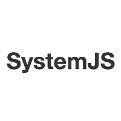

# Fountain Webapp Generator

> This Yeoman generator allows you to start any Webapp with the best Developer Experience out of the box!

> No matter what framework or module management you want to use, we got you covered with a cutting edge working configuration.

> We use [Gulp 4](http://gulpjs.com/) as a task manager but we'll ask you questions about:
- Framework: React, Angular 1, Angular 2, none
- Modules management: Webpack, SystemJS, none
- JS preprocessor: Babel, TypeScript, none
- CSS preprocessor: Sass, Less, none

This generator is the entry point of the Yeoman Fountain generators for webapps. It can be considered as the v2 of [generator-gulp-angular](https://github.com/Swiip/generator-gulp-angular).

## Generator Fountain Webapp structure

To take profit of the best of the Yeoman infrastructure, we heavily relies on the composability natures of the generators.

Thereby, each needs of your future application will be addressed by a dedicated Yeoman generator (each will be used depending of the options you selected or not).

More informations in [DESIGN.md](DESIGN.md).

### Web framework layer
This generators can be used directly to bypass the framework question.

[](https://github.com/FountainJS/generator-fountain-react)
[](https://github.com/FountainJS/generator-fountain-angular1)
[](https://github.com/FountainJS/generator-fountain-angular2)

### Web tooling layer
[](https://github.com/FountainJS/generator-fountain-gulp)
[](https://github.com/FountainJS/generator-fountain-eslint)
[](https://github.com/FountainJS/generator-fountain-browsersync)
[](https://github.com/FountainJS/generator-fountain-karma)

### Module management layer
[](https://github.com/FountainJS/generator-fountain-webpack)
[](https://github.com/FountainJS/generator-fountain-systemjs)
[](https://github.com/FountainJS/generator-fountain-inject)


### Usage

### Requirement Node 4+ && NPM 3+
This generator is targeted to be used with Node >= 4.0.0 and NPM => 3.0.0. You can check your version number with the command
```
node --version && npm --version
```

### Install

##### Install required tools `yo`:
```
npm install -g yo
```

##### Install `generator-fountain-webapp`:
```
npm install -g generator-fountain-webapp
```


### Run

##### Create a new directory, and go into:
```
mkdir my-new-project && cd my-new-project
```

##### Run `yo fountain-webapp`, and select desired technologies:
```
yo fountain-webapp
```

### [Start development](http://fountainjs.io/doc/usage/#use-npm-scripts)


## [Changelog](https://github.com/FountainJS/generator-fountain-webapp/releases)


## [Contributing](http://fountainjs.io/doc/contributing)
